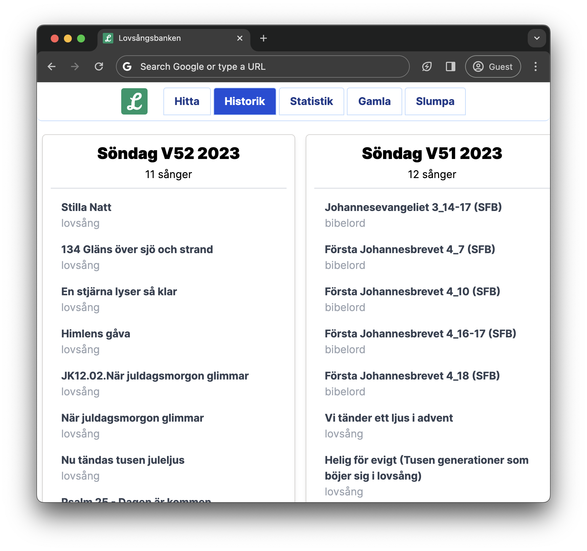
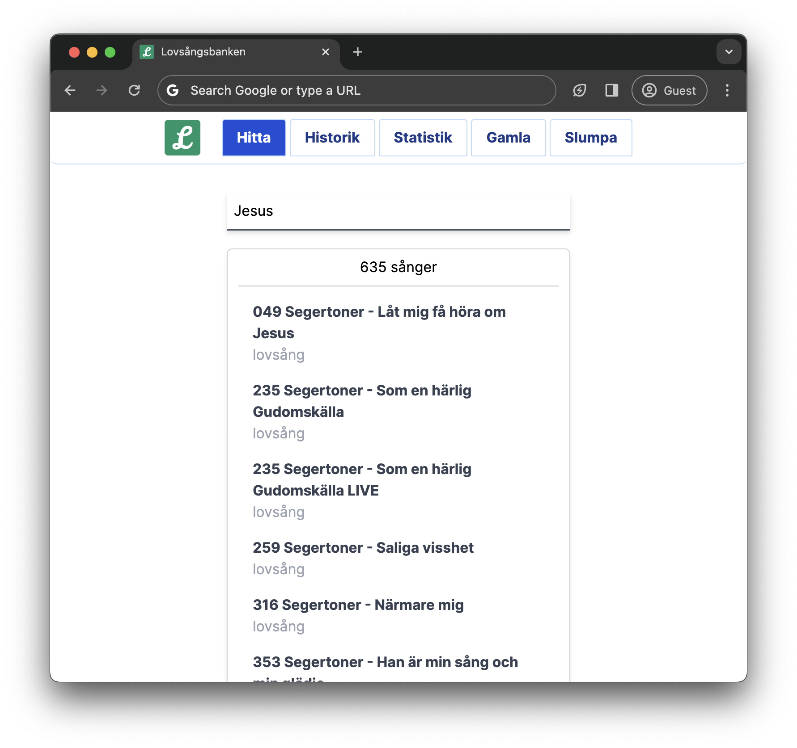

# pro6db-dashboard

**A web interface for viewing and querying your ProPresenter songs and playlists**



At sunday mornings, a very common question from the worship leader to the computer guy is
"does this song exist in the ProPresenter database"?
That question ought to be answered by a web-based tool. So, here we are.

## Overview

The web app uses data from these propresenter files:

- The default pro6pl file, located at `~/Library/Application Support/RenewedVision/ProPresenter6/Playlists/ProPresenter6.pro6pl` by default
- The pro6 song files, located at `~/Documents/ProPresenter6` by default

For your convenience, I've created a service that runs on your Mac with Propresenter 6 Mac.
The service converts the above mentioned files to json and uploads the json files to a configured S3-compatible server.

## Installation and usage

```bash
pip3 install 'git+https://github.com/MrYakobo/pro6-dashboard#subdirectory=sync_service'

# run once to init config
pro6-dashboard-sync

# add your s3 bucket credentials, then try syncing
pro6-dashboard-sync

# when you see it's working, enable the background service (will sync every 30 minutes)
pro6-enable-service
```

The configuration resides in `~/.config/pro6-dashboard/config.toml`
and is documented in [the example config](./sync_service/pro6_dashboard_sync/example.config.toml).

## Deploying the web app

Requires `npm` to be installed on your development machine.
Building the web app "burns" the S3 bucket url into a variable `VITE_DATA_BASE_URL`.

The web app requires the urls `$VITE_DATA_BASE_URL/songs.json` and `$VITE_DATA_BASE_URL/songs.json` to be accessible anonymously, and over CORS.

Build the web app like this:

```bash
cd web
npm install
VITE_DATA_BASE_URL=https://your-s3-compatible-server/bucket_name/data npm run build
```

Then deploy dist/* on your web server. I recommend using [Cloudflare Pages][2] for that.

```bash
# your own web server
scp dist/* your_server:/var/www

# cloudflare pages
npx wrangler pages project create
npx wrangler pages deploy dist
```

[1]: https://www.cloudflare.com/developer-platform/r2/
[2]: https://pages.cloudflare.com/

## Technical Background

Propresenter6 manages it's database in plist XML.
File extensions are .pro6pl for playlists and .pro6 for song files.
To make the playlist and song data accessible for a web client,
I've written scripts to convert the plists to two JSON files: `songs.json` and `playlists.json`.

These JSON files need to live somewhere, so the web app can fetch the database.
For maximum availability, I recommend using [Cloudflare R2][1] (but any S3-compatible service ought to work) for hosting these JSON files. It's free and nice hosting.
If you choose this route, `pro6-dashboard-sync` takes care syncing to a S3-bucket.

You can also self-host everything. Then you'll need to upload `songs.json` and `playlists.json`, generated from `pro6-dashboard-convert`, to your own web server.

# Screenshots

**Querying the database**



**Viewing history of the latest sundays**

